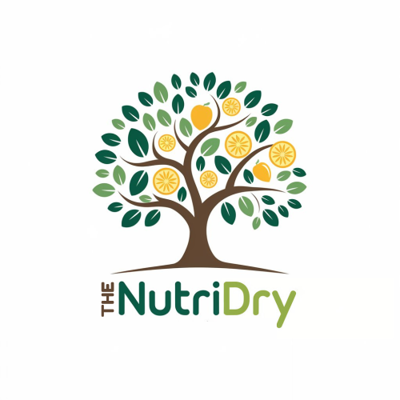

# TheNutriDry - Premium Dehydrated Products E-commerce



This is a modern e-commerce platform built with Next.js for TheNutriDry, offering premium quality dehydrated fruits and vegetables that are 100% natural with no additives or preservatives.

## Features

- **Responsive Design**: Fully responsive UI that works on mobile, tablet, and desktop
- **Dark Mode Support**: Automatic and manual dark mode switching
- **Product Catalog**: Browse products by category with search and filtering
- **User Authentication**: Secure login and registration system
- **Shopping Cart**: Add products to cart with quantity management
- **Checkout Process**: Streamlined checkout with address and payment integration
- **Admin Dashboard**: Manage products, orders, and inventory
- **SEO Optimized**: Built with best practices for search engine visibility

## Tech Stack

- **Frontend**: Next.js 15, React 19, Tailwind CSS
- **State Management**: React Context API, SWR for data fetching
- **Database**: MongoDB with Prisma ORM
- **Authentication**: NextAuth.js
- **Animations**: Framer Motion
- **Deployment**: Vercel

## Getting Started

First, run the development server:

```bash
npm run dev
# or
yarn dev
# or
pnpm dev
# or
bun dev
```

Open [http://localhost:3000](http://localhost:3000) with your browser to see the result.

## Project Structure

- `app/` - Next.js App Router pages and layouts
- `components/` - Reusable UI components
- `context/` - React Context providers
- `lib/` - Utility functions and helpers
- `public/` - Static assets
- `prisma/` - Database schema and migrations

## Learn More

To learn more about the technologies used in this project:

- [Next.js Documentation](https://nextjs.org/docs)
- [React Documentation](https://react.dev/)
- [Tailwind CSS](https://tailwindcss.com/docs)
- [Prisma](https://www.prisma.io/docs)
- [MongoDB](https://docs.mongodb.com/)

## Deployment

The easiest way to deploy this application is using the [Vercel Platform](https://vercel.com/new).

## License

This project is proprietary and owned by TheNutriDry.

